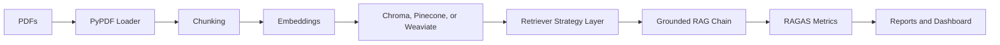

# Enterprise-RAG-Evaluation-Framework
An enterprise-grade Retrieval Augmented Generation evaluation framework built with LangChain, RAGAS, PDF ingestion, vector databases, retrieval strategy comparison, reports, dashboard, Docker deployment, and CI/CD.
# What It Delivers
1.System architecture and data-flow diagrams in docs/.
2.Python implementation under src/rag_eval.
3.PDF ingestion with page/source metadata.
4.Vector database support for ChromaDB, Pinecone, and Weaviate.
5.Retrieval method comparison: vector similarity, MMR, BM25, and hybrid ensemble.
6.Evaluation metrics: context precision, context recall, faithfulness, answer relevancy.
7.CSV and Markdown reports.
8.Streamlit dashboard for leadership and model-quality review.
9.Docker and Docker Compose deployment.
10.GitHub Actions pipeline for linting, testing, and image build.
# System Architecture

# Retrieval Methods Compared
1.Vector similarity: baseline dense retrieval.
2.MMR diverse retrieval: reduces redundant context and improves topic coverage.
3.BM25 keyword retrieval: strong for exact terms, IDs, SKUs, policy names, and legal language.
4.Hybrid ensemble: combines semantic and lexical retrieval for enterprise document variance.

# CI/CD
The GitHub Actions pipeline in .github/workflows/ci.yml performs:
1.Python dependency install.
2.Ruff linting.
3.Pytest unit tests.
4.Docker image build.

# Recommended production additions:
Publish images to GHCR/ECR.
Run scheduled nightly evaluations on a frozen gold set.
Block deployment when faithfulness or recall drop beyond thresholds.
Upload reports as build artifacts.
Send quality regression alerts to Slack or PagerDuty.

# Production Scalability Recommendations
Separate ingestion from serving with queues and idempotent document jobs.
Version every corpus, embedding model, chunking policy, retriever, prompt, and LLM.
Use managed Pinecone or a horizontally scaled Weaviate cluster for high-QPS retrieval.
Add a reranker such as Cohere Rerank, bge-reranker, or cross-encoder models for high-value flows.
Cache embeddings and frequent query responses with semantic cache keys.
Store source-level ACL metadata and enforce authorization before generation.
Add observability for retrieval latency, token cost, empty-context rate, citation coverage, and hallucination incidents.
Run online A/B tests after offline evaluation improves.
Maintain gold, adversarial, freshness, and domain-specific evaluation sets.
Use canary deploys and automatic rollback on quality or latency regressions.
