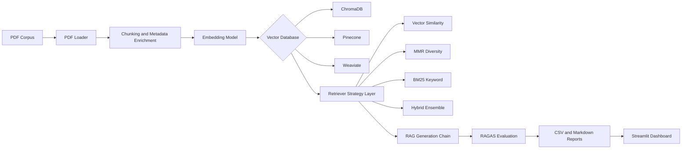
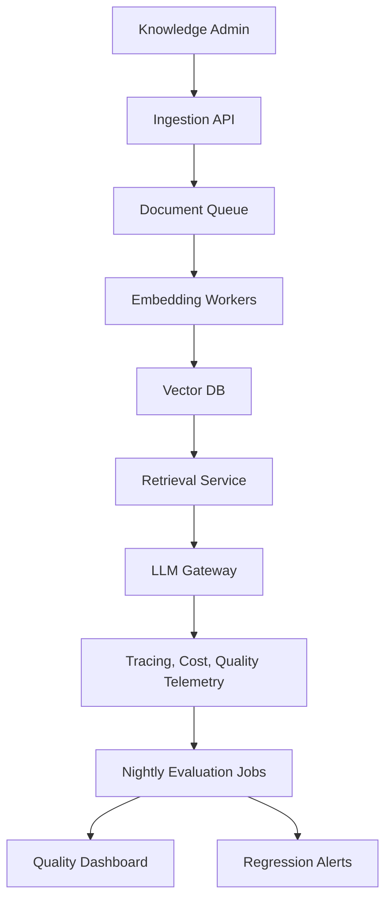

# System Architecture

## Components

- Ingestion: loads PDFs, preserves source/page metadata, and chunks text for retrieval.
- Vector stores: supports ChromaDB for local development, Pinecone for managed scale, and Weaviate for self-hosted or hybrid deployments.
- Retrieval comparison: runs the same evaluation set across similarity, MMR, BM25, and hybrid ensemble strategies.
- Generation: uses a grounded LangChain prompt that refuses unsupported answers.
- Evaluation: computes context precision, context recall, faithfulness, and answer relevancy through RAGAS.
- Reporting: emits machine-readable CSVs, an executive markdown report, and an interactive dashboard.

## Production Control Plane

